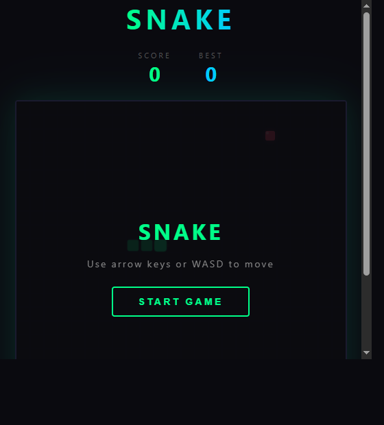
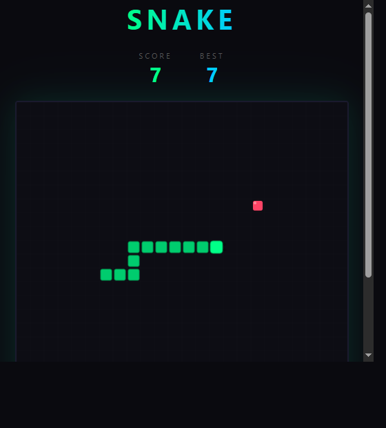
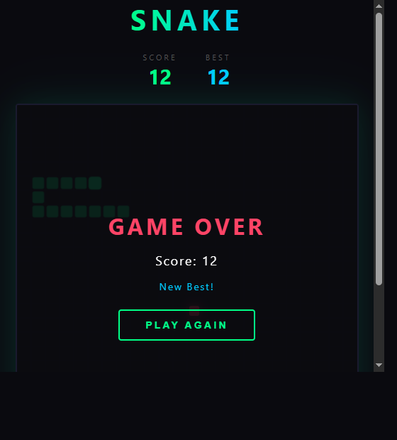

# Snake Game

A classic Snake game built with vanilla HTML, CSS, and JavaScript — no dependencies, runs entirely in the browser.

**[Play Live](https://mesmatmm.github.io/snake-game/)**

---

## Screenshots

### Start Screen


### Gameplay


### Game Over


---

## Features

- Smooth canvas-based rendering with a dark neon theme
- Snake eyes that follow movement direction
- Food with animated pulsing glow effect
- Score tracking with local best score (persisted via `localStorage`)
- Progressive speed — gets faster every 5 points (150ms → 60ms minimum)
- Pause / resume support
- Game over screen with "New Best!" highlight

## Controls

| Key | Action |
|-----|--------|
| `Arrow Keys` / `WASD` | Move snake |
| `P` | Pause / Resume |

## How to Run Locally

Just open `index.html` in any modern browser — no server or build step needed.

```bash
git clone https://github.com/mesmatmm/snake-game.git
cd snake-game
open index.html   # or double-click the file
```

## Built With

- HTML5 Canvas
- Vanilla JavaScript
- CSS3
